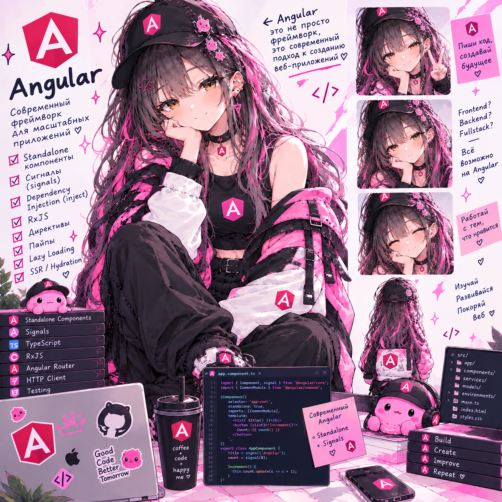

# Angular Lab — RoomBook

> **26.09.2026 — методичка вычитана и исправлена.** Что найдено и что поправлено — в [fixes/angular.md](https://github.com/meeymirita/lab-fixes/blob/main/angular.md) репозитория `lab-fixes`.

**Статус: ⚪ методичка готова, прохождение впереди.**
**Сложность: высокая.** Проект полностью самостоятельный (свой репозиторий `angular-lab`), кода из других лаб не берёт. TypeScript — на уровне сессий 1–3 TS-лабы; всё специфичное для Angular (декораторы, DI, сигналы) объясняется здесь. Опыт Vue полезен для сравнений, но не обязателен.

## О чём

Внутренний сервис бронирования переговорных: каталог комнат, расписание дня, форма брони с проверкой пересечений, «мои брони», живые обновления, админка. Современный Angular — это сигналы + DI: реактивность без zone.js, сервисы и провайдеры, `httpResource`, Signal Forms, роутер с guards по ролям и RxJS там, где он правда нужен (поиск с гонкой ответов, живое расписание через SSE). Почти в каждой сессии есть шаг «сломать → починить»: мутация массива, которую OnPush не видит; гонка ответов поиска; провайдер не на том уровне; утечка подписки; форма, которую можно покинуть с несохранёнными данными; пересечение броней, пропущенное клиентом.

## Стек

Angular 22 (standalone, zoneless, OnPush по умолчанию), Angular CLI + `@angular/build` (esbuild + Vite), сервисы-сторы на сигналах, `HttpClient` (fetch) + интерцепторы + `httpResource`, Signal Forms и Reactive Forms, RxJS 7 + rxjs-interop, Vitest через `ng test`. Бэкенд готовый: `api/server.mjs` — Node 22 без зависимостей, данные в памяти. Docker Compose, в проде — nginx.

## Формат

Методичка [`Angular_Lab_RoomBook.html`](Angular_Lab_RoomBook.html) — открывается в браузере, прогресс по чекбоксам сохраняется локально. У каждого шага: код → «зачем» → команда → ожидаемый результат → «проверь себя»; ответы — в `docs/angular-notes.md`.

## Что внутри (6 сессий, 26 шагов, ~20,5 ч)

- **Сессия 1** (~3 ч) — стенд и основы: готовый API и `ng new`, компоненты с `input`/`output` и `@for`, `signal`/`computed`/`model`/`linkedSignal`/`effect`; ломаем OnPush + zoneless мутацией массива (счётчик растёт, а сетка нет)
- **Сессия 2** (~3,5 ч) — DI и HTTP: сервисы, уровни провайдеров и `InjectionToken` (провайдер не на том уровне), `HttpClient` + `toSignal`, `httpResource` с фильтрами на сервере, поиск без гонки ответов (`mergeMap` → `switchMap`), интерцепторы лога и ошибок
- **Сессия 3** (~3 ч) — роутер: маршруты, lazy-загрузка, AppShell, дочерние маршруты расписания (и параметры родителя), resolver и индикатор навигации, query params как состояние
- **Сессия 4** (~4 ч) — формы: Signal Forms (модель и схема), межполевая валидация, `validateHttp` для проверки свободного слота, submit и 409 после «свободно», свой контрол, Reactive Forms в админке
- **Сессия 5** (~3,5 ч) — авторизация, состояние, потоки: AuthStore, вход, токен и 401, guards `canActivate`/`canMatch`/`canDeactivate`, стор на сигналах и утечка броней при смене пользователя, SSE + RxJS и `takeUntilDestroyed`
- **Сессия 6** (~3,5 ч) — качество и продакшн: pipe и `@defer`, тесты (компонент, стор, guard) на Vitest, сборка, runtime-конфиг и nginx, финальная карта и сравнение с Vue/Nuxt

Разделы 1–9 методички — теория (зачем Angular после Vue и Nuxt, азбука на примере RoomBook, реактивность на сигналах и почему нет zone.js, DI под капотом, RxJS в 2026 году, роутер, три вида форм, HTTP и интерцепторы, стек и структура проекта), раздел 10 — шесть сессий заданий, разделы 11–14 — чек-лист, глоссарий, вопросы для собеседования, что дальше.

---

Часть сборного репозитория лабораторных работ — [anitech-performance](https://github.com/meeymirita/anitech-performance).
